# FlowTrack

[](https://github.com/aelena/flowtrack/actions/workflows/ci.yml)
[](LICENSE)
[](backend/)
[](frontend/)
[](docker-compose.yml)

**A project tracker that makes you write down when to quit.**

Every project here carries two fields no other tracker asks for: `abandonment_criteria`, written up front, before you are emotionally invested; and two separate completion figures — the objective one computed from tasks, and your own honest estimate. The gap between them is a diagnosis.

It is a triage tool for people with too many side projects, not a to-do app. No Gantt charts, no agile artifacts, no burndown. Just my own way of tracking, built around a **Project** as a stateful bag of properties moving through a lightweight lifecycle. It will probably not work for you out of the box, and that is fine — it is opinionated on purpose.

## Architecture

| Component | Technology | Port |
|-----------|------------|------|
| Frontend  | SvelteKit (plain CSS, no Tailwind) | **7027** |
| API       | FastAPI (async, API key auth) | **7028** |
| Database  | PostgreSQL 16 (SQL + JSONB) | **7029** |

## In detail

```mermaid
%% Generated by https://gitdiagram.com/aelena/flowtrack
flowchart TD

subgraph group_frontend["Web interface"]
  node_webapp["Home and settings<br/>[+page.svelte]"]
  node_projectview["Project workspace<br/>[ProjectView.svelte]"]
  node_sidebar["Project navigation<br/>[Sidebar.svelte]"]
  node_commands["Commands and exports<br/>[CommandBar.svelte]"]
  node_tasksui["Task editor<br/>[TaskList.svelte]"]
  node_notesui["Notes and writing<br/>[NoteEditor.svelte]"]
  node_writemode["Write mode<br/>[WriteMode.svelte]"]
  node_apiclient["Web API client<br/>[api.js]"]
end

subgraph group_api["API and domain"]
  node_apiapp["HTTP API<br/>[main.py]"]
  node_projectapi["Project lifecycle<br/>[projects.py]"]
  node_areaapi["Areas<br/>[areas.py]"]
  node_taskapi["Task operations<br/>[tasks.py]"]
  node_noteapi["Notes<br/>[notes.py]"]
  node_fileapi["Project files<br/>[files.py]"]
  node_backupapi["Backup and restore<br/>[backup.py]"]
  node_configapi["Configuration<br/>[config.py]"]
  node_documentsapi["Project documents<br/>[documents.py]"]
  node_extensionapi["Browser clipper<br/>[extension.py]"]
end

subgraph group_data["Persistence"]
  node_models["Domain records<br/>[models.py]"]
  node_database["Database sessions<br/>[database.py]"]
  node_postgres[("PostgreSQL")]
end

subgraph group_agent["Agent and integrations"]
  node_mcpserver["MCP tools and prompts<br/>[server.py]"]
  node_mcpclient["REST transport<br/>[client.py]"]
end

node_user(("User"))
node_agentactor(("Agent"))

node_user -->|"uses"| node_webapp
node_webapp -->|"shows navigation"| node_sidebar
node_webapp -->|"loads portfolio"| node_apiclient
node_user -->|"opens project"| node_projectview
node_projectview -->|"requests project data"| node_apiclient
node_projectview -->|"renders tasks"| node_tasksui
node_projectview -->|"renders notes"| node_notesui
node_projectview -->|"renders commands"| node_commands
node_projectview -->|"renders writing"| node_writemode
node_sidebar -->|"requests projects"| node_apiclient
node_tasksui -->|"updates tasks"| node_apiclient
node_notesui -->|"updates notes"| node_apiclient
node_commands -->|"requests exports"| node_apiclient
node_writemode -->|"supports writing"| node_notesui
node_apiclient -->|"sends API requests"| node_apiapp
node_apiapp -->|"registers routes"| node_projectapi
node_apiapp -->|"registers routes"| node_areaapi
node_apiapp -->|"registers routes"| node_taskapi
node_apiapp -->|"registers routes"| node_noteapi
node_apiapp -->|"registers routes"| node_fileapi
node_apiapp -->|"registers routes"| node_backupapi
node_apiapp -->|"registers routes"| node_configapi
node_apiapp -->|"registers routes"| node_documentsapi
node_apiapp -->|"registers routes"| node_extensionapi
node_projectapi -->|"uses sessions"| node_database
node_areaapi -->|"uses sessions"| node_database
node_taskapi -->|"uses sessions"| node_database
node_noteapi -->|"uses sessions"| node_database
node_fileapi -->|"uses sessions"| node_database
node_backupapi -->|"uses sessions"| node_database
node_configapi -->|"uses settings"| node_database
node_documentsapi -->|"reads records"| node_database
node_extensionapi -->|"uses sessions"| node_database
node_database -->|"persists data"| node_postgres
node_projectapi -->|"queries projects"| node_models
node_taskapi -->|"creates tasks"| node_models
node_noteapi -->|"manages notes"| node_models
node_fileapi -->|"manages file records"| node_models
node_agentactor -->|"invokes tools"| node_mcpserver
node_mcpserver -->|"calls transport"| node_mcpclient
node_mcpclient -->|"calls REST API"| node_apiapp

click node_webapp "https://github.com/aelena/flowtrack/blob/main/frontend/src/routes/%2Bpage.svelte"
click node_projectview "https://github.com/aelena/flowtrack/blob/main/frontend/src/lib/components/ProjectView.svelte"
click node_sidebar "https://github.com/aelena/flowtrack/blob/main/frontend/src/lib/components/Sidebar.svelte"
click node_commands "https://github.com/aelena/flowtrack/blob/main/frontend/src/lib/components/CommandBar.svelte"
click node_tasksui "https://github.com/aelena/flowtrack/blob/main/frontend/src/lib/components/TaskList.svelte"
click node_notesui "https://github.com/aelena/flowtrack/blob/main/frontend/src/lib/components/NoteEditor.svelte"
click node_writemode "https://github.com/aelena/flowtrack/blob/main/frontend/src/lib/components/WriteMode.svelte"
click node_apiclient "https://github.com/aelena/flowtrack/blob/main/frontend/src/lib/api.js"
click node_apiapp "https://github.com/aelena/flowtrack/blob/main/backend/app/main.py"
click node_projectapi "https://github.com/aelena/flowtrack/blob/main/backend/app/routers/projects.py"
click node_areaapi "https://github.com/aelena/flowtrack/blob/main/backend/app/routers/areas.py"
click node_taskapi "https://github.com/aelena/flowtrack/blob/main/backend/app/routers/tasks.py"
click node_noteapi "https://github.com/aelena/flowtrack/blob/main/backend/app/routers/notes.py"
click node_fileapi "https://github.com/aelena/flowtrack/blob/main/backend/app/routers/files.py"
click node_backupapi "https://github.com/aelena/flowtrack/blob/main/backend/app/routers/backup.py"
click node_configapi "https://github.com/aelena/flowtrack/blob/main/backend/app/routers/config.py"
click node_documentsapi "https://github.com/aelena/flowtrack/blob/main/backend/app/routers/documents.py"
click node_extensionapi "https://github.com/aelena/flowtrack/blob/main/backend/app/routers/extension.py"
click node_models "https://github.com/aelena/flowtrack/blob/main/backend/app/models.py"
click node_database "https://github.com/aelena/flowtrack/blob/main/backend/app/database.py"
click node_mcpserver "https://github.com/aelena/flowtrack/blob/main/mcp-server/src/flowtrack_mcp/server.py"
click node_mcpclient "https://github.com/aelena/flowtrack/blob/main/mcp-server/src/flowtrack_mcp/client.py"

classDef toneNeutral fill:#f8fafc,stroke:#334155,stroke-width:1.5px,color:#0f172a
classDef toneBlue fill:#dbeafe,stroke:#2563eb,stroke-width:1.5px,color:#172554
classDef toneAmber fill:#fef3c7,stroke:#d97706,stroke-width:1.5px,color:#78350f
classDef toneMint fill:#dcfce7,stroke:#16a34a,stroke-width:1.5px,color:#14532d
classDef toneRose fill:#ffe4e6,stroke:#e11d48,stroke-width:1.5px,color:#881337
classDef toneIndigo fill:#e0e7ff,stroke:#4f46e5,stroke-width:1.5px,color:#312e81
classDef toneTeal fill:#ccfbf1,stroke:#0f766e,stroke-width:1.5px,color:#134e4a
class node_webapp,node_projectview,node_sidebar,node_commands,node_tasksui,node_notesui,node_writemode,node_apiclient,node_user toneBlue
class node_apiapp,node_projectapi,node_areaapi,node_taskapi,node_noteapi,node_fileapi,node_backupapi,node_configapi,node_documentsapi,node_extensionapi toneAmber
class node_models,node_database,node_postgres toneMint
class node_mcpserver,node_mcpclient toneRose
class node_agentactor toneIndigo
```

Also visible here [](https://gitdiagram.com/aelena/flowtrack?utm_source=readme&utm_medium=badge)



## Quick Start

```bash
git clone https://github.com/aelena/flowtrack.git
cd flowtrack

# 1. Create your environment file (the defaults work as-is for local use)
cp .env.example .env

# 2. Build and run
docker compose up --build

# 3. Open
# Frontend:  http://localhost:7027
# API docs:  http://localhost:7028/docs
# Database:  localhost:7029
```

`.env` is gitignored. Without it, `docker compose` has no values for
`POSTGRES_USER` and friends and the database container will not start — so
step 1 is not optional.

## Environment Variables

Copy `.env.example` to `.env` and adjust:

| Variable | Default | Description |
|----------|---------|-------------|
| `POSTGRES_USER` | `flowtrack` | Database user |
| `POSTGRES_PASSWORD` | `flowtrack_secret` | Database password |
| `POSTGRES_DB` | `flowtrack` | Database name |
| `DATABASE_URL` | `postgresql+asyncpg://...@db:5432/flowtrack` | Internal DB connection (container-to-container, port 5432) |
| `API_KEY` | `ft_dev_key_change_me` | API key for all endpoints (`X-API-Key` header) |
| `STORAGE_PATH` | `/app/storage` | Persistent file storage path |
| `CORS_ORIGINS` | `http://localhost:7027` | Comma-separated allowed origins for CORS |

## Features

### Projects
- Work-in-progress and tentative final names
- Description, vision, goal, completion/abandonment criteria
- Pre-mortem: written before the work starts, imagining the project has failed and saying why. Inline markdown on the project, plus attached documents under a `premortem` folder. Exported with backups, quoted by `/reckoning`
- Star rating (1-5), subjective completion %, task-based completion %
- GitHub repo and website links
- Local directory reference
- Collaborators list
- Grouping by **Areas** (folders) with drag-and-drop between areas
- Project status: **active**, **on hold**, **deprecated**
- Archive without deletion
- Pin to the home page, GitHub-style: pinned projects sit above the recent ones and stay there whatever their activity
- Home page shows 6, 12, 24 or all recent projects (remembered per browser)
- Sidebar quick actions per project (archive, ZIP download, on hold, deprecated)

### Tasks
- Three statuses: new, in progress, done (click to cycle)
- Filter the list by status (all, pending, in progress, done), with a count on each; the API takes `?status=` for the same thing
- Bulk creation from bullet or ordered lists
- Notes can be attached to tasks

### Notes
- Markdown content with live preview
- Attachable to projects or individual tasks

### Files
- Upload PDF, DOCX, MD, and other reference files
- Right-side file tree panel on project view, organized by folder
- Subfolders for skills, personalities, context files, etc.
- Persistent storage survives container restarts

### Write Mode
- Split-screen: markdown editor on left, live preview on right
- Zen-style distraction-free writing

### Commands
- Generate PRD, BRD, MRD from project data — deterministic, with JSON download buttons
- Export project as ZIP (includes files)
- View pending tasks summary
- Copy a `cd <dir> && claude` command for the project directory

### Configuration (`/settings`)
- YAML-based configuration editor, edited as raw YAML
- Provider API keys are redacted on read; leave the redaction placeholder in place to keep the stored value
- Save, reset to defaults

### Backup & Restore (`/settings`)
- **Export**: download all project data as a single JSON file (areas, projects, tasks, notes, snippets — no file attachments)
- **Export selected**: pick some projects (archived ones included) and download only those, their snippets and the areas they use, in the same file shape, so the same import reads both
- **Import**: upload a JSON backup to merge into the database (skips existing records by ID)
- Useful for backup, migration, or transferring data between instances

### UI
- Dark and light theme toggle
- English and Spanish language toggle
- Font selector (Segoe UI, Georgia, Consolas, Arial, Palatino)
- Collapsible sidebar with project tree
- Search, filter by area, sort by name/date
- URL-based routing (`/projects/:id`) for deep linking
- SVG favicon for browser tab identification

## AI: the MCP server

FlowTrack does not call a model, and that is a decision rather than a gap.

Earlier versions pretended otherwise. Chat Mode returned an echo, "suggest next steps" was a handful of hardcoded heuristics, and the settings page happily stored OpenAI and Anthropic keys that nothing ever read. The obvious fix was to implement the layer for real — provider abstraction, streaming, key management, cost ceilings — and the honest assessment was that all of that work would end in a worse chat than the one already open in the next terminal window.

So the direction inverted. **FlowTrack stopped trying to be an AI application and became a tool an agent drives**, through an MCP server in [`mcp-server/`](mcp-server/). That deleted the fake surface instead of filling it in: the chat endpoint, the suggestion heuristics, the social-copy generator and the entire `llm_providers` table are gone. The feature arrived as a net removal of code, and there are no provider API keys left in the system to leak.

### What it gives an agent

Twelve tools, and the number is deliberate. A server with one tool per REST endpoint gives the agent thirty ways to ask a question and no basis for choosing. These are shaped around what you actually want to know about a portfolio, plus three (`create_project`, `describe_project`, `archive_project`) so an agent can register a whole folder of projects without anyone opening the UI.

| Tool | |
|---|---|
| `portfolio_digest` | **The one that matters.** What is stale, what is overdue, active count against the WIP limit, and where the objective and subjective completion figures disagree most — in one call |
| `list_projects` | Compact digest, filterable by area, status, minimum stars, or days untouched |
| `get_project` | Full detail for one project, with tasks and notes |
| `add_tasks` | Bulk creation from a markdown list |
| `update_task_status` | new / in_progress / done |
| `add_note` | The durable record — decisions, especially decisions to stop |
| `set_project_state` | Status, stars, subjective completion: the verbs of a triage |

Two resources: `flowtrack://portfolio` renders every non-archived project as one markdown document, so an agent can take in the whole picture in a single cheap read; `flowtrack://project/{id}` does the same for one project.

### The prompts are the opinionated part

Prompts are the least-used corner of MCP and the reason this server is worth having rather than a generic database wrapper. They encode the opinions the tool exists to enforce.

**`/reckoning`** walks the stale and overdue projects one at a time, quotes each project's own `abandonment_criteria` back at you, and forces a single decision: continue, freeze, or kill. It records the answer, in your words, dated. It stops every five projects to ask whether to go on, and it does not soften the question — because freezing and killing are successful outcomes, and a portfolio where everything stays active is the failure this tool was built to prevent.

**`/next`** gives one recommendation rather than three options, and refuses to suggest starting anything while the WIP limit is exceeded.

**`/close-out`** drafts the abandonment note for a project you are stopping: what it was for, what got built, why it is stopping — specific and unsentimental, "no demand was ever tested" beats "priorities shifted" — and what is worth salvaging, by filename.

### Setup

```bash
claude mcp add flowtrack \
  --env FLOWTRACK_API_KEY=ft_dev_key_change_me \
  -- uvx --from ./mcp-server flowtrack-mcp
```

Full configuration, including Claude Desktop and Cursor, in [`mcp-server/README.md`](mcp-server/README.md).

### Companion Claude Skill

🔥 If you are using FlowTrack with multiple projects (in my case 60+) then note that A **Claude Code skill** lives in [`skills/flowtrack/`](skills/flowtrack/): copy it to `~/.claude/skills/flowtrack/` and any coding session can keep a project's record honest from inside the repo. Drop a `.flowtrack` file (`{"project_id": "...", "name": "..."}`) at a repo's root and `/flowtrack` finds the project, reads its abandonment criteria and open tasks at the start of a session, closes tasks as features ship, records decisions as dated notes, and leaves the next steps and an honest completion figure at the end.

### One thing to keep in mind

**Notes and snippets are data, not instructions.** Some of them arrive from arbitrary web pages through the Chrome clipper, which means a note can contain text engineered to read like a directive. The server's instructions say so explicitly, and any prompt built on top of this should treat note content as material to evaluate rather than orders to follow.

### Acting on a note from the UI

A note that says *"take the venv out of version control — that's 2000 files of junk"* is an actionable instruction sitting a long way from the repository it applies to. So each note carries an **Open session** button that starts a coding session in the project's directory, pointed at that note.

It appears only on notes belonging to a project that has `local_dir` set, because without a directory there is nowhere to open. The three actions are **Act on this**, **Explain this** and **Draft a plan**; the last two change nothing on disk.

This is where the MCP server pays for itself twice. The button does not need to stuff the note's text into a command line — which would mean quoting hell on two operating systems and a hard 8191-character limit in `cmd.exe`. It passes two ids and lets the agent fetch the note itself, along with the rest of the project's context.

**It needs one small process running on your machine**, in [`launcher/`](launcher/), because a containerised API cannot open a terminal on your host. Zero dependencies beyond the Python standard library:

```bash
export FLOWTRACK_API_KEY=ft_dev_key_change_me
python launcher/flowtrack_launcher.py
```

**Without it the buttons still work** — they copy the equivalent command to your clipboard instead. One paste rather than one click, and nothing to install. The Settings page shows which mode you are in.

The security model is the part worth reading before you run it, and it comes down to a single rule: **the launcher never executes anything the browser sends.** The request carries only `{project_id, note_id, action}` with `action` from a fixed set; the prompts live in the launcher's source and the command is assembled from its own configuration. The browser picks an intent, the launcher picks the command. Full detail, including what it does *not* defend against, in [`launcher/README.md`](launcher/README.md).

## Chrome Extension

Located in `extension/`. Load as an unpacked extension in Chrome:

1. Go to `chrome://extensions/`
2. Enable "Developer mode"
3. Click "Load unpacked" and select the `extension/` folder
4. Click the extension icon, configure API URL (`http://localhost:7028`) and API key — the
   key must match `API_KEY` in `.env`, which ships as `ft_dev_key_change_me`
5. Pick a project in the popup, then use the buttons or the right-click menu ("Save to FlowTrack")

The project list loads as soon as both fields are filled; the **↻** button reloads
it. If it stays on "Not loaded", the error under the buttons says why and stays
there until you act on it — a rejected key, an unreachable URL, or FlowTrack not
running. No CORS change is needed for the default `localhost` setup: the manifest's
`host_permissions` cover it, and Chrome does not enforce CORS on an extension's own
fetches to a host it has permission for.

**The + button starts a new project from the popup**, with just a name. An idea
found on the web is often not a clip for an existing project but the beginning of
a new one, and having to open the app first is how it gets lost. The new project
is selected and remembered immediately, so the clip you were about to save — and
the next right-click — go to it. Fill in the rest in FlowTrack proper.

**The project you pick in the popup is where right-click clips go.** The context
menu has no picker of its own, so it reuses that choice, which is remembered
between sessions. Clips record the page they came from in `source_url`.

**Leave the picker on "Inbox (unfiled)" to clip without deciding.** That is the
default, and the point: when you come across an idea worth exploring later, the
cost of capturing it should not be choosing a home for it. Unfiled clips land in
a project called `Inbox`, created the first time one is needed — no schema
change, no migration, just a reserved name (see `backend/app/inbox.py`). Re-file
a clip from the project page's clip panel, or with `PUT /api/snippets/{id}`.

The `Inbox` is exempt from the project health dot: it is a holding pen with no
target date that is meant to sit there collecting things, so staleness means
nothing for it. It does still count as one active project in
`portfolio_digest`'s WIP tally.

Text selected on the page is read with `chrome.scripting`, which cannot run on
`chrome://` pages, the Chrome Web Store or PDF viewers. There the popup says so
and you can paste into the box instead.

The manifest declares `host_permissions` for `localhost` and `127.0.0.1`, which
is what lets the extension call the API at all — without it every request is
blocked before it leaves the browser. If you run FlowTrack on another host, the
extension has no button to ask for that: grant it by hand from
`chrome://extensions` → FlowTrack Clipper → "Site access", and add the extension
origin to `CORS_ORIGINS`:

```
CORS_ORIGINS=http://localhost:7027,chrome-extension://<your-extension-id>
```

## API Endpoints

All endpoints require `X-API-Key` header.

| Method | Path | Description |
|--------|------|-------------|
| GET | `/api/health` | Health check |
| **Areas** | | |
| GET/POST | `/api/areas/` | List/create areas |
| PUT/DELETE | `/api/areas/{id}` | Update/delete area (ungroups projects) |
| **Projects** | | |
| GET/POST | `/api/projects/` | List/create projects (query: search, area_id, sort_by, sort_order, archived) |
| GET/PUT | `/api/projects/{id}` | Get/update project |
| POST | `/api/projects/{id}/archive` | Archive project |
| POST | `/api/projects/{id}/unarchive` | Bring a project back out of the archive |
| POST | `/api/projects/{id}/pin` | Pin to the home page |
| POST | `/api/projects/{id}/unpin` | Unpin |
| POST | `/api/projects/{id}/export` | Export as ZIP (with files) |
| GET | `/api/projects/{id}/pending` | Pending tasks summary |
| POST | `/api/projects/{id}/collaborators` | Add collaborator |
| **Tasks** | | |
| GET/POST | `/api/projects/{pid}/tasks/` | List/create tasks (bulk from lists) |
| PUT/DELETE | `/api/projects/{pid}/tasks/{id}` | Update/delete task |
| **Notes** | | |
| GET/POST | `/api/notes/` | List/create notes (query: project_id, task_id) |
| PUT/DELETE | `/api/notes/{id}` | Update/delete note |
| **Files** | | |
| GET/POST | `/api/projects/{pid}/files/` | List/upload files |
| GET | `/api/projects/{pid}/files/{id}/download` | Download file |
| DELETE | `/api/projects/{pid}/files/{id}` | Delete file |
| **Extension** | | |
| GET | `/api/extension/projects` | Simplified project list for Chrome extension |
| GET | `/api/extension/inbox` | Where unfiled clips land; reports absent before first use |
| POST | `/api/extension/project` | Create a project from the clipper, name only |
| POST | `/api/extension/snippet` | Save URL/snippet. Omit `project_id` to file it in the `Inbox` |
| **Snippets (clips)** | | |
| GET | `/api/snippets/` | List clips, newest first (query: project_id, limit) |
| PUT | `/api/snippets/{id}` | Re-file a clip under a different project |
| DELETE | `/api/snippets/{id}` | Delete a clip |
| **Documents** | | |
| POST | `/api/documents/prd/{id}` | Generate PRD |
| POST | `/api/documents/brd/{id}` | Generate BRD |
| POST | `/api/documents/mrd/{id}` | Generate MRD |
| **Config** | | |
| GET | `/api/config/` | Get parsed config |
| GET/PUT | `/api/config/yaml` | Get/update config as YAML |
| POST | `/api/config/reset` | Reset config to defaults |
| **Backup** | | |
| GET | `/api/backup/export` | Export all data as JSON; repeat `project_ids=` to export only those projects |
| POST | `/api/backup/import` | Import data from JSON |

## Running Tests

> **The suite drops every table after each test.** It therefore defaults to a
> separate `flowtrack_test` database and refuses to start if `TEST_DATABASE_URL`
> points at a database whose name does not end in `_test`.

Create the throwaway database once:

```bash
docker compose exec db psql -U flowtrack -d postgres -c 'CREATE DATABASE flowtrack_test;'
```

Then run the suite inside the API container (no local Python needed):

```bash
docker compose exec \
  -e TEST_DATABASE_URL=postgresql+asyncpg://flowtrack:flowtrack_secret@db:5432/flowtrack_test \
  api python -m pytest -q
```

Or from the host, against the published database port:

```bash
cd backend
pip install -r requirements.txt -r requirements-dev.txt
pytest -q          # uses localhost:7029/flowtrack_test by default
```

## Project Structure

```
flowtrack/
  .env                          # Environment variables
  docker-compose.yml            # Container orchestration (ports 7027-7029)
  README.md                     # This file
  specs.md                      # Original product specification
  backend/
    Dockerfile
    requirements.txt
    app/
      main.py                   # FastAPI app entry point
      config.py                 # Settings from .env
      database.py               # Async SQLAlchemy setup + migrations
      models.py                 # All database models (Area, Project, Task, Note, etc.)
      schemas.py                # Pydantic request/response schemas
      dependencies.py           # API key verification
      routers/
        areas.py                # Area CRUD
        projects.py             # Project CRUD + export/archive/status
        tasks.py                # Task CRUD with bulk creation
        notes.py                # Note CRUD
        files.py                # File upload/download
        extension.py            # Chrome extension endpoints
        documents.py            # Deterministic PRD/BRD/MRD generation
        config.py               # YAML configuration management
        backup.py               # Full data export/import (JSON)
    tests/
      conftest.py               # Test fixtures with async DB
      test_areas.py
      test_projects.py
      test_tasks.py
      test_notes.py
  frontend/
    Dockerfile
    package.json
    svelte.config.js
    vite.config.js
    src/
      app.html                  # HTML shell with favicon
      app.css                   # Global styles, CSS variables, dark/light themes
      routes/
        +layout.svelte          # App shell: sidebar + toolbar (theme, lang, font, settings)
        +page.svelte            # Home dashboard with project cards
        projects/[id]/
          +page.svelte          # Project detail page
        settings/
          +page.svelte          # Settings: YAML config, API key, backup/restore
      lib/
        api.js                  # API client (all endpoints)
        stores.js               # Svelte stores (theme, lang, font, projects, etc.)
        i18n.js                 # EN/ES translations
        components/
          Sidebar.svelte        # Collapsible tree with drag-drop, search, actions
          ProjectView.svelte    # Two-column: project content + file tree panel
          TaskList.svelte       # Task list with status cycling
          AddTaskModal.svelte   # Bulk task creation modal
          NoteEditor.svelte     # Markdown note editor with preview
          WriteMode.svelte      # Split markdown/preview zen editor
          CommandBar.svelte     # Commands with download buttons (PRD, BRD, etc.)
    static/
      favicon.svg               # SVG favicon
  mcp-server/
    pyproject.toml              # Installable with uvx / pipx
    src/flowtrack_mcp/
      server.py                 # 9 tools, 2 resources, 3 prompts
      client.py                 # Thin async client over the REST API
    tests/
    smoke_test.py               # Drives the real stdio handshake
  extension/
    manifest.json               # Chrome extension manifest (V3)
    popup.html                  # Extension popup UI
    popup.css                   # Extension styles (zen aesthetic)
    popup.js                    # Extension logic (save URL/snippet)
    background.js               # Context menu service worker
    package.json                # Lint tooling only — the extension has no build
    eslint.config.js            # Chrome globals; runs in CI
```
